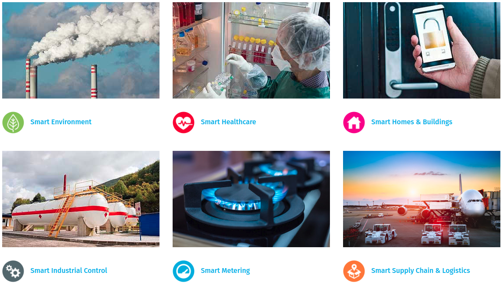

# Long Range <!-- .element: style="margin-top:3em" -->
<!-- .slide: data-background="https://aptinex.com/wp-content/uploads/2017/09/iot-lora-alliance-logo.svg.png" data-background-size="30%" data-background-position="top" -->

## ¿Qué es?
Es un protocolo de comunicación inalámbrico de largo alcance diseñado para IoT que compite contra otras tecnologías *LPWAN*.

### ¿Qué es *LPWAN*?
*Low Power Wide-area Network* (Red de área ámplia de **baja energía**).

Detallado en [***RFC 8376***](https://tools.ietf.org/html/rfc8376).

### ¿Por qué **bajo consumo**?
Crucial para dispositivos *IoT*.

La comunicación persistente conlleva un gasto energético importante.

## Características de *LPWAN*
 * Baja frecuencia
 * Largo alcance
 * Bajo consumo
 * Bajo coste

#### Otras tecnologías *LPWAN*

### Otras tecnologías *LPWAN*
 * *SigFox*
 * *Symphony Link*
 * *Weightless*
 * *LTE-M*
 * *Narrowband-IoT (NB-IoT)*

### *SigFox*
<!-- .slide: data-background="./img/sigfox.jpg" data-background-size="cover" data-background-opacity="0.3" data-background-position="top" -->
Fundado en 2009 por *Labège*, en Francia.

Tecnología propietaria. 

Baja frecuencia para largo alcance. Apps con pequeños e infrecuentes datos.

### *Symphony Link*
<!-- .slide: data-background="./img/symphony-link.jpg" data-background-size="cover" data-background-opacity="0.3" data-background-position="top" -->
Capa MAC software sobre chips de la empresa *Semtech*, por *Link Labs* en 2013 (EEUU).

Añade acuse de recibo de mensajes, actualizaciones *OTA*, capacidad de actuación como repetidor, etc.

### *Weightless*
Fundado en 2008 con la misión de estandarizar las tecnologías *LPWAN* por empresas como *Accenture*, *ARM* y *Sony*.

#### Versiones:
 - *Weighless-W*: aprovecha el espacio no utilizado por la banda de TV.
 - *Weighless-N*: versión sin licencia cerrada de *NB-IoT*.
 - *Weighless-P*: protocolo bidireccional basado en la tecnología de *M2COMM*.

## *Weightless/NWave*
Similar a *SigFox* implementando una mejor capa MAC.

Permite coexistencia con otras tecnologías de radio sin ruido adicional.

Ideal para apps sencillas (sensorización de temperatura, capacidad, etc).

## Beneficios de LoRa
 * Funciona sobre frecuencia libre: banda ***ISM*** (en Europa 433MHz o 868MHz).
 * Usa una técnica de modulación de espectro ensanchado.
 * Está dividido en dos partes: capa física y LoRaWAN *(Long Range Wide Area Network)*.

## Desventajas de LoRa
 * El protocolo de la capa física es propietario
 * Envío 1% del tiempo, como máximo
 * Instalación y mantenimiento manual de los *gateways*

## Aplicaciones de LoRa

## LoRaWAN <!-- .element: style="margin-top:2em" -->
<!-- .slide: data-background="https://www.thethingsnetwork.org/docs/lorawan/LoRaWAN-Overview.png" data-background-size="65%" data-background-opacity="1.0" data-background-position="top" -->