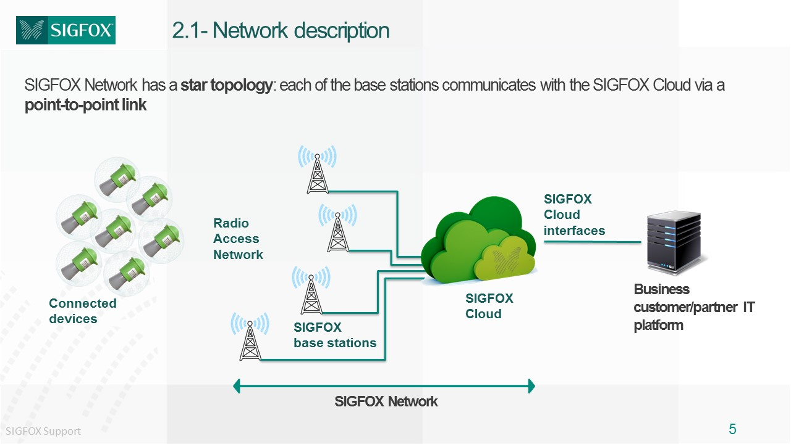
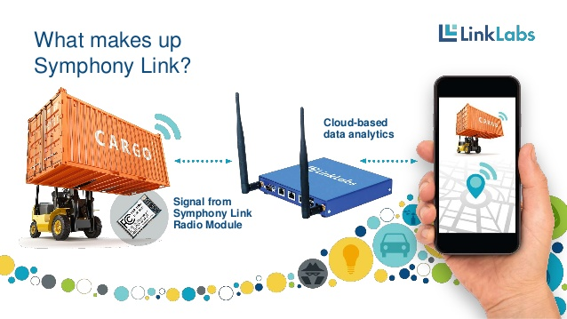

# ***LoRa** (Long Range)* <!-- .element: style="margin-top:3em" -->
<!-- .slide: data-background="https://aptinex.com/wp-content/uploads/2017/09/iot-lora-alliance-logo.svg.png" data-background-size="30%" data-background-position="top" -->

## ¿Qué es?
Es un protocolo de comunicación inalámbrico de largo alcance diseñado para IoT que compite contra otras tecnologías *LPWAN*.<!-- .element: class="fragment" data-fragment-index="1" -->

### ¿Qué es *LPWAN*? <!-- .element: class="fragment" data-fragment-index="2" -->
*Low Power Wide-area Network* (Red de área ámplia de **baja energía**).<!-- .element: class="fragment" data-fragment-index="3" -->

Detallado en [***RFC 8376***](https://tools.ietf.org/html/rfc8376).

### ¿Por qué "baja energía"? <!-- .element: class="fragment" data-fragment-index="4" -->
Crucial para dispositivos IoT.<!-- .element: class="fragment" data-fragment-index="5" -->

La comunicación persistente requiere de mucho sustento.

## Atributos de *LPWAN*
 * Baja frecuencia
 * Largo alcance
 * Bajo consumo
 * Bajo coste

## Otras tecnologías *LPWAN*
 * *SigFox*
 * *Symphony Link*
 * *Weightless*
 * *LTE-M*
 * *Narrowband-IoT (NB-IoT)*

## *SigFox*
Fundado en 2009 por *Labège*, en Francia.

Tecnología propietaria. 

Baja frecuencia para largo alcance. Apps con pequeños e infrecuentes datos.

## *Symphony Link*
Capa MAC software sobre chips de la empresa *Semtech*, por *Link Labs* en 2013 (EEUU).

Añade acuse de recibo de mensajes, actualizaciones *OTA*, capacidad de actuación como repetidor, etc.

## *Weightless/NWave*
Similar a *SigFox* implementando una mejor capa MAC.

Permite coexistencia con otras tecnologías de radio sin ruido adicional.

Ideal para apps sencillas (sensorización de temperatura, capacidad, etc).

## *Weightless*
Fundado en 2008 con la misión de estandarizar las tecnologías *LPWAN* por empresas como *Accenture*, *ARM* y *Sony*.

#### Versiones:
 - *Weighless-W*: aprovecha el espacio no utilizado por la banda de TV.
 - *Weighless-N*: versión sin licencia cerrada de *NB-IoT*.
 - *Weighless-P*: protocolo bidireccional basado en la tecnología de *M2COMM*.

La versión *W* es más potente, consume más y es menos popular.

## Beneficios de LoRa
 * Funciona sobre frecuencia libre: banda ***ISM*** (en Europa 433MHz o 868MHz).
 * Usa una técnica de modulación de espectro ensanchado.
 * Está dividido en dos partes: capa física y LoRaWAN *(Long Range Wide Area Network)*.

## Desventajas de LoRa
 * El protocolo de la capa física es propietario
 * Envío 1% del tiempo, como máximo

## LoRaWAN
